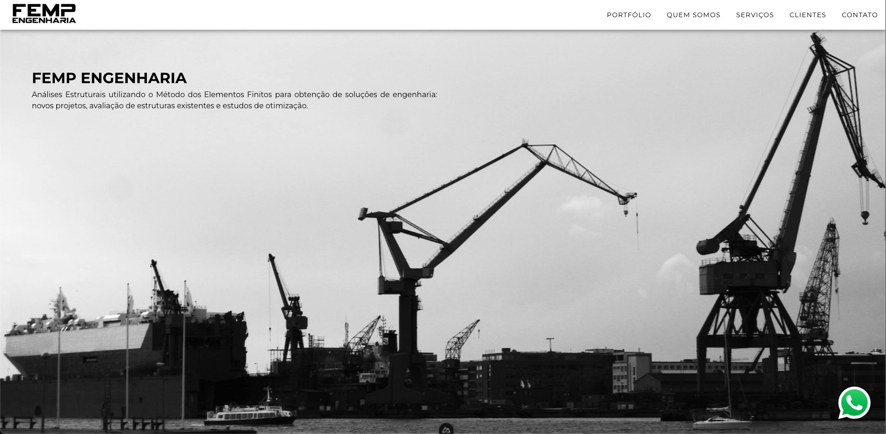

# Femp Engenharia

## 📜 Overview

Welcome to the official website repository of **Femp Engenharia**, a Brazilian engineering consultancy specializing in structural analysis, finite element modeling (FEM), and advanced computational simulations. This repository hosts the source code for our online presence, built with a focus on performance, accessibility, and SEO.

---

## 🔑 Key Features

- 🚀 **Fast & Flexible:** Built using the latest techs available for blazing fast and SEO friendly landing pages
- 📦 **Modular:** Landing page architecture is quite modular and easy to tweak
- 🧑‍💻 **Developer Showoff:** I've been coding much more with React lately, but this may be enough for you to hire me in a Vue project 😉

---

## 🛠 Technologies Used

- **Frontend:** Vue3, Vuetify, Nuxt.js
- **Deployment:** SSG generated and deployed to DigitalOcean least expensive machine

---

## 🚀 Project Setup

### Prerequisites

Make sure you have the following installed:

- [Node.js](https://nodejs.org/) (>=18.0.0)
- [Npm](https://www.npmjs.com/) (recommended, but you can also use yarn)

### Installation

Clone the repository and install dependencies:

    git clone https://github.com/ploissken/femp.git
    cd femp
    npm run install

### Development

Start the local development server:

    npm run dev

The site will be available at [http://localhost:3000](http://localhost:3000)

### Production

Generate a production build:

    npm run build

Preview the production output:

    npm run preview

### Deployment

Deployment is done on DigitalOcean, take a look at [Femp Engenharia](https://fempengenharia.com.br). Built statically (SSG) with

    npm run generate

    npx serve .output/public

---

## 🧩 Project Structure

- `components/` — Reusable UI components
- `pages/` — Landing page index with all it's Sections
- `assets/` — Static assets consumed by the page
- `config/` — Magic numbers as consts to help rendering
- `locales/` — Currently only in PT, but ready for more
- `nuxt.config.ts` — Nuxt app configuration
- `docker-compose.yml` — Docker container for deployment under Traefik Orchestration

---

## 🛠 Built With

- **Nuxt 3** — Vue framework for SSR & static sites
- **Vuetify 3** — Material Design UI library
- **TypeScript** — Type-safe JavaScript
- **Vite** — Fast build tool & dev server
- **Nuxt Image** — Built-in image optimization
- **Docker** — Containerized deployment

---

## 🌐 Localization

- Default: **pt-BR**
- Future: **en-US** (comming soon)

---

## 📸 Screenshots

  
_Hero page_

Live demo [here](https://fempengenharia.com.br)

---

## 📄 License

CC BY 4.0 — see [LICENSE](https://creativecommons.org/licenses/by/4.0/) for details.

---

## 📬 Contact

You can reach me at ploissken at gmail or connect with me on [LinkedIn](https://www.linkedin.com/in/rodrigo-souza-97302724/).
